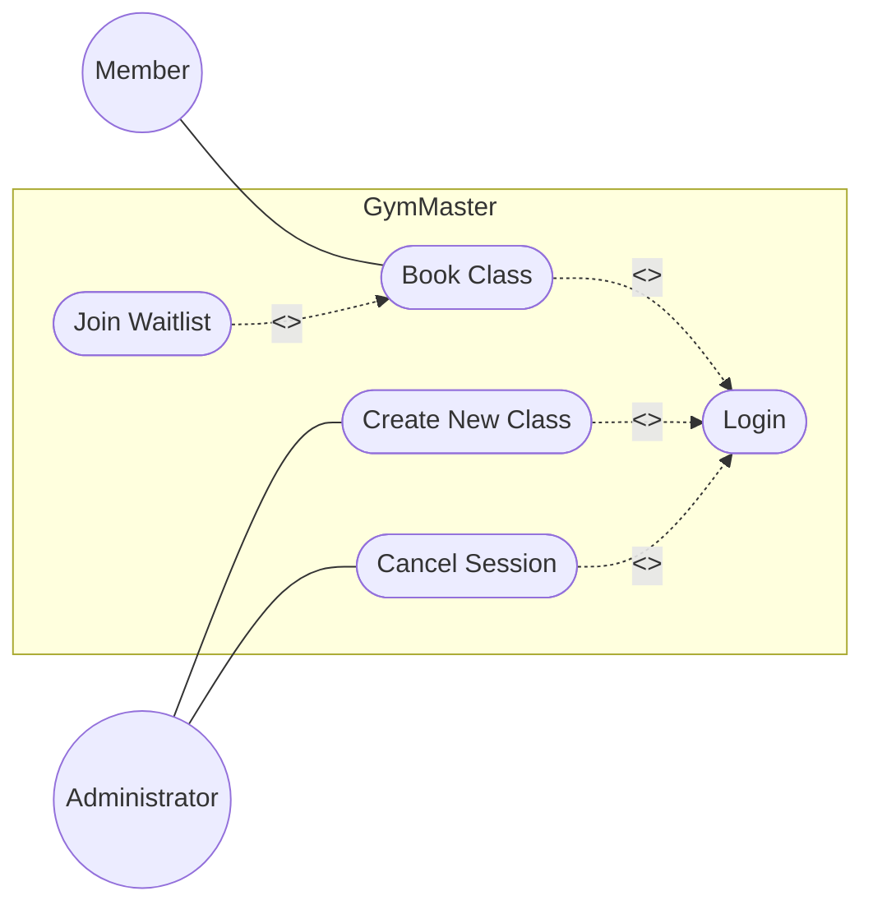
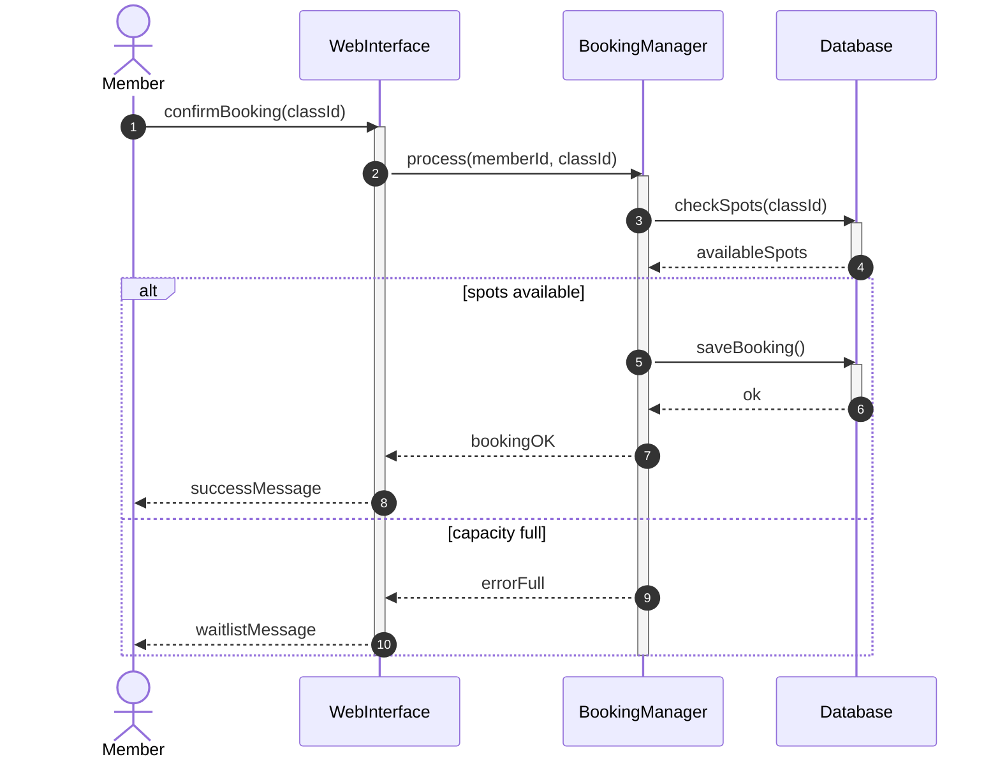
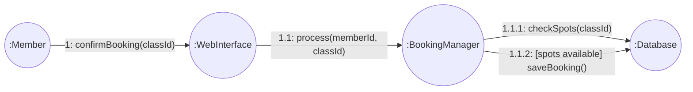
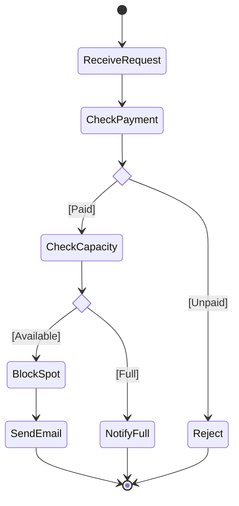
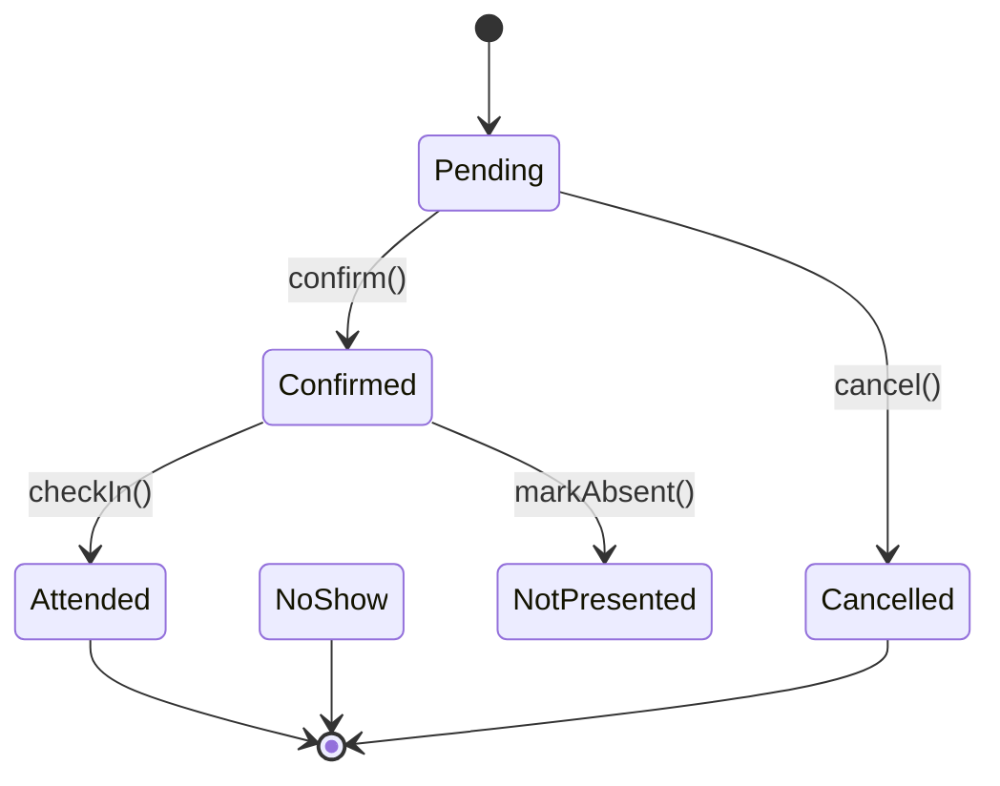

# Entornos-7.5

 EJERCICIO  1.Análisis de Requisitos
 

```mermaid
graph LR

Member((Member))
Admin((Administrator))

subgraph "GymMaster"
CU1([Book Class])
CU2([Join Waitlist])
CU3([Create New Class])
CU4([Cancel Session])
CU5([Login])
end

Member --- CU1
Admin --- CU3
Admin --- CU4

CU1 -.->|<<include>>| CU5
CU2 -.->|<<extend>>| CU1
CU3 -.->|<<include>>| CU5
CU4 -.->|<<include>>| CU5
```

EJERCICIO 2 Diseño de la Interacción

```mermaid
sequenceDiagram
    autonumber
    actor Member
    participant WebInterface
    participant BookingManager
    participant Database

    Member ->> WebInterface: confirmBooking(classId)
    activate WebInterface

    WebInterface ->> BookingManager: process(memberId, classId)
    activate BookingManager
    
    BookingManager ->> Database: checkSpots(classId)
    activate Database

    Database -->> BookingManager: availableSpots
    deactivate Database

    alt spots available
        BookingManager ->> Database: saveBooking()
        activate Database
        Database -->> BookingManager: ok
        deactivate Database

        BookingManager -->> WebInterface: bookingOK
        WebInterface -->> Member: successMessage
    
    else capacity full
        BookingManager -->> WebInterface: errorFull
        WebInterface -->> Member: waitlistMessage
    end

    deactivate BookingManager
    deactivate WebInterface
```
EJERCICIO 3

```mermaid
graph LR

Member((:Member))
-- "1: confirmBooking(classId)"
--> Interface((:WebInterface))

Interface
-- "1.1: process(memberId, classId)"
--> Manager((:BookingManager))

Manager
-- "1.1.1: checkSpots(classId)"
--> DB((:Database))

Manager
-- "1.1.2: [spots available] saveBooking()"
--> DB
```

EJERCICIO 4 Lógica del Proceso

```mermaid
stateDiagram-v2
    [*] --> ReceiveRequest

    ReceiveRequest --> CheckPayment
    
    state paymentDecision <<choice>>
    CheckPayment --> paymentDecision
    
    paymentDecision --> CheckCapacity: [Paid]
    paymentDecision --> Reject: [Unpaid]

    state capacityDecision <<choice>>
    CheckCapacity --> capacityDecision

    capacityDecision --> BlockSpot: [Available]
    capacityDecision --> NotifyFull: [Full]

    BlockSpot --> SendEmail

    SendEmail --> [*]
    Reject --> [*]
    NotifyFull --> [*]
```

EJERCICIO 5 Ciclo de Vida del Objeto

```mermaid
stateDiagram-v2
    [*] --> Pending

    Pending --> Confirmed : confirm()
    Pending --> Cancelled : cancel()

    Confirmed --> Attended : checkIn()
    Confirmed --> NotPresented : markAbsent()

    Attended --> [*]
    NoShow --> [*]
    Cancelled --> [*]
```
