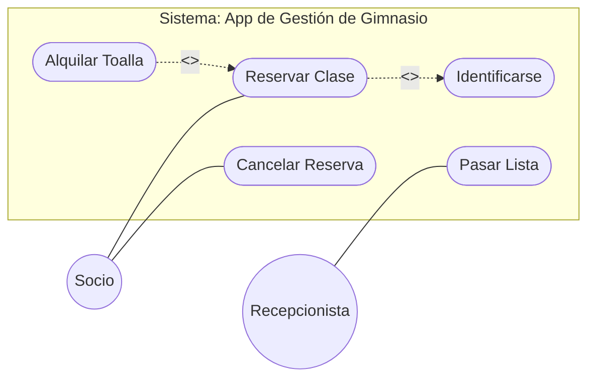

# Entornos-7.5

EJERCICIO 1 

```mermaid
graph LR
    %% Actores
    Socio((Socio))
    Recepcionista((Recepcionista))

    %% Límite del sistema
    subgraph "Sistema: App de Gestión de Gimnasio"
        UC1([Reservar Clase])
        UC2([Identificarse])
        UC3([Cancelar Reserva])
        UC4([Alquilar Toalla])
        UC5([Pasar Lista])

        %% Relaciones entre casos de uso
        UC1 -.->|<<include>>| UC2
        UC4 -.->|<<extend>>| UC1
    end

    %% Relaciones actor-caso de uso
    Socio --- UC1
    Socio --- UC3
    Recepcionista --- UC5
```

