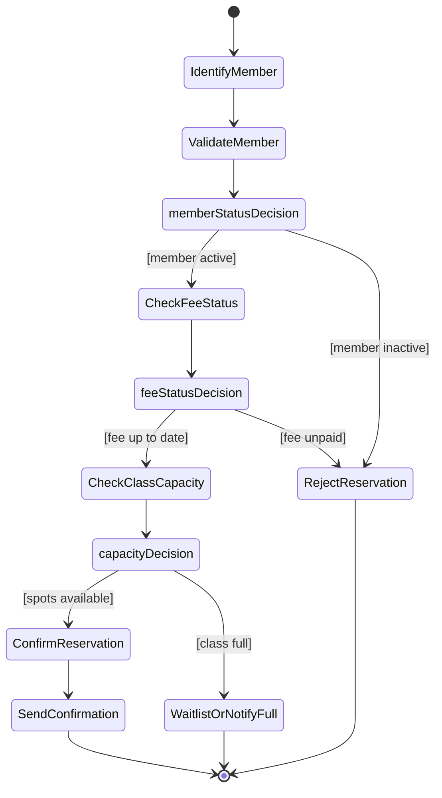
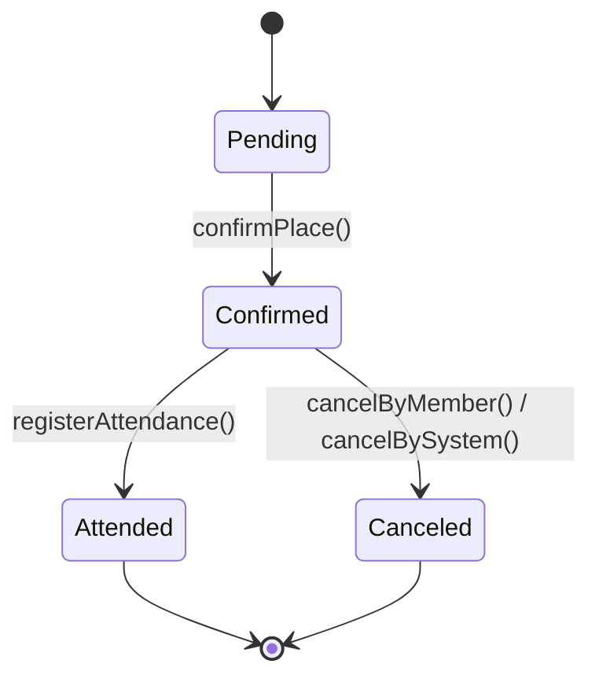
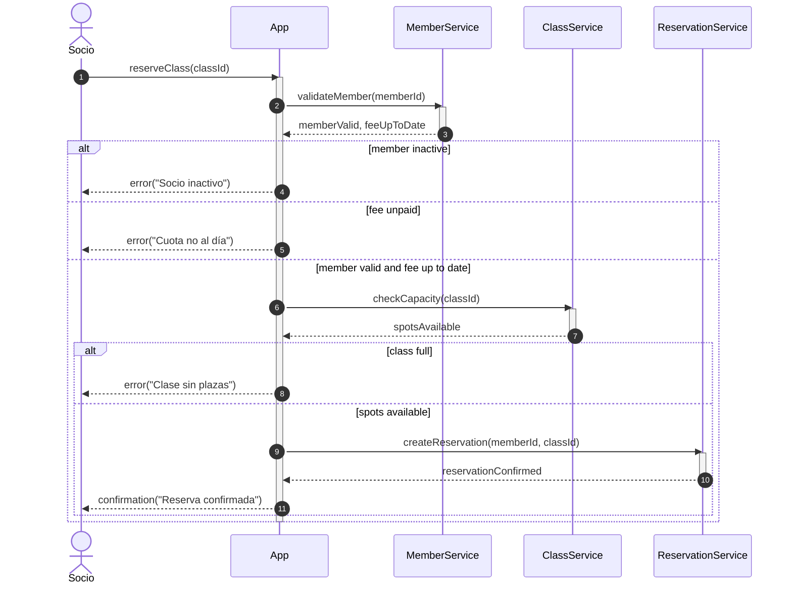
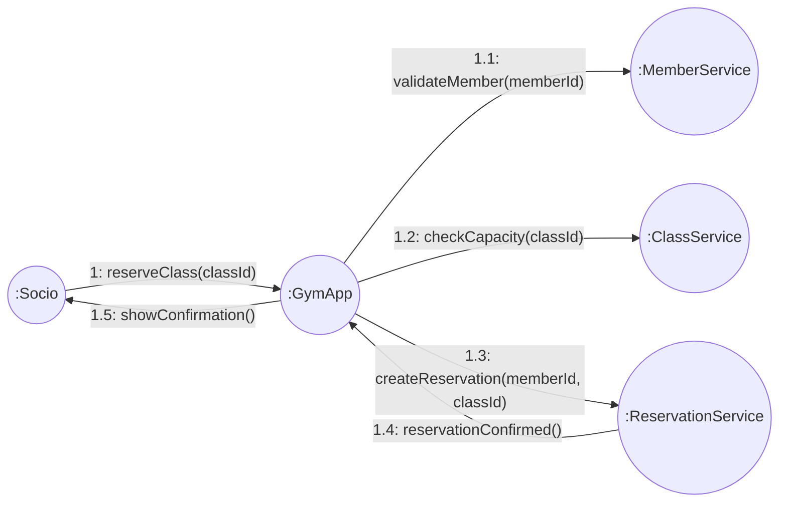

# Entornos-7.5

EJERCICIO 1 

```mermaid
graph LR
    %% Actores
    Socio((Socio))
    Recepcionista((Recepcionista))

    %% Límite del sistema
    subgraph "Sistema: App de Gestión de Gimnasio"
        UC1([Reservar Clase])
        UC2([Identificarse])
        UC3([Cancelar Reserva])
        UC4([Alquilar Toalla])
        UC5([Pasar Lista])

        %% Relaciones entre casos de uso
        UC1 -.->|<<include>>| UC2
        UC4 -.->|<<extend>>| UC1
    end

    %% Relaciones actor-caso de uso
    Socio --- UC1
    Socio --- UC3
    Recepcionista --- UC5
```

EJERCICIO 2

```mermaid
stateDiagram-v2
    [*] --> IdentifyMember

    IdentifyMember --> ValidateMember
    ValidateMember --> memberStatusDecision

    state memberStatusDecision <<choice>>
    memberStatusDecision --> CheckFeeStatus : [member active]
    memberStatusDecision --> RejectReservation : [member inactive]

    CheckFeeStatus --> feeStatusDecision
    state feeStatusDecision <<choice>>
    feeStatusDecision --> CheckClassCapacity : [fee up to date]
    feeStatusDecision --> RejectReservation : [fee unpaid]

    CheckClassCapacity --> capacityDecision
    state capacityDecision <<choice>>
    capacityDecision --> ConfirmReservation : [spots available]
    capacityDecision --> WaitlistOrNotifyFull : [class full]

    ConfirmReservation --> SendConfirmation
    SendConfirmation --> [*]

    RejectReservation --> [*]
    WaitlistOrNotifyFull --> [*]
```

EJERCICIO 3

```mermaid
stateDiagram-v2
    [*] --> Pending

    Pending --> Confirmed : confirmPlace()
    Confirmed --> Attended : registerAttendance()
    Confirmed --> Canceled : cancelByMember() / cancelBySystem()

    Attended --> [*]
    Canceled --> [*]
```
EJERCICIO 4

```mermaid
sequenceDiagram
    autonumber
    actor Socio
    participant App
    participant MemberService
    participant ClassService
    participant ReservationService

    Socio->>App: reserveClass(classId)
    activate App

    App->>MemberService: validateMember(memberId)
    activate MemberService
    MemberService-->>App: memberValid, feeUpToDate
    deactivate MemberService

    alt member inactive
        App-->>Socio: error("Socio inactivo")
    else fee unpaid
        App-->>Socio: error("Cuota no al día")
    else member valid and fee up to date
        App->>ClassService: checkCapacity(classId)
        activate ClassService
        ClassService-->>App: spotsAvailable
        deactivate ClassService

        alt class full
            App-->>Socio: error("Clase sin plazas")
        else spots available
            App->>ReservationService: createReservation(memberId, classId)
            activate ReservationService
            ReservationService-->>App: reservationConfirmed
            deactivate ReservationService

            App-->>Socio: confirmation("Reserva confirmada")
        end
    end

    deactivate App
```
EJERCICIO 5

```mermaid
graph LR
    Socio((:Socio))
    App((:GymApp))
    MemberService((:MemberService))
    ClassService((:ClassService))
    ReservationService((:ReservationService))

    Socio -- "1: reserveClass(classId)" --> App
    App -- "1.1: validateMember(memberId)" --> MemberService
    App -- "1.2: checkCapacity(classId)" --> ClassService
    App -- "1.3: createReservation(memberId, classId)" --> ReservationService
    ReservationService -- "1.4: reservationConfirmed()" --> App
    App -- "1.5: showConfirmation()" --> Socio
```
